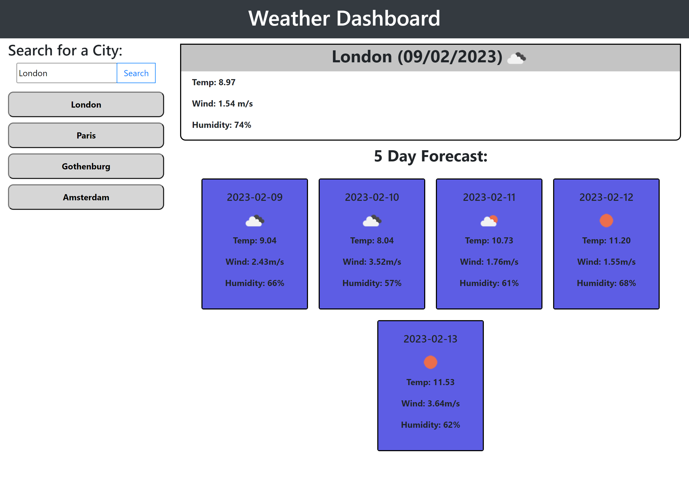

# George Ryder - Weather-Dashboard

## Description

An app that allows users to see the weather forecast for cities of their choosing.

My main motivation behind building this project was to learn more about server APIs and how I could use them to make a dyanmic and interactive website. Building this project also allowed me to build upon my learning from previous projects such as the use of jquery, moment.js and local storage. This website was also built as it serves a real-world function. It can help you to know what the weather is in a location you are in, or perhaping visiting, for both the current day and the next 5 days. This helps to solve the problem of going to an area and not knowing what the weather is going to be like; by using this web-application that problem no longer exists.

I learnt a lot during this project and expanded upon what I had previously learnt. I learnt a lot more about using server APIs and using .ajax to generate the calls to these servers. I also learnt more about how to manipulate objects to get the data that was neccessary. Whilst I learnt a lot, I think there are a number of features that could be implemented to improve this web app in the future. I think some of the code could be improved through the use of functions to cut out on some repetitiveness. As for the web-app itself, I think a future improvement could be to create a toggle for the information a user wants to see, for example a user may want to see just the current temperature and max temperature so you could allow toggles just for this information to be displayed. I think this would be an interesting concept to revisit however, I think it would require some significant code refactoring. I also think some improvements could be made to the search history, perhaps a button to clear the history and making sure you can't have the same search twice in the history. Perhaps also a maximum limit on the search history before it pops off the oldest value and pushes in the newest.

## Installation

Github repository: https://github.com/NotGeorgeHere/Weather-Dashboard

Live Deployment Page: https://notgeorgehere.github.io/Weather-Dashboard

## Usage

